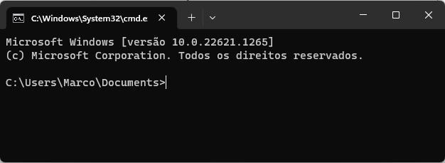
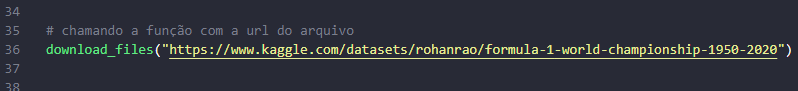

# **API Kaggle - Download dados** {#topo}


#### Esse projeto tem o propósito de fazer o downlaod dos dados do site [Kaggle](https://www.kaggle.com/datasets). 


## Execução
<!--ts-->
   * [1. Iniciar](#1-iniciar)
   * [2. Clonar Projeto](#clonar-projeto)
   * [3. Criar ambiente](#3-criar-ambiente)
   * [4. Bibliotecas fundamentais](#4-bibliotecas)
   * [5. URL do dataset](#5-url)
   * [6. Procedimento para executar](#6-procedimento)
<!--te-->


### 1. Iniciar {#1-iniciar}
##### Para iniciar o desenvolvimento, abra o seu prompt de comando(cmd) em um diretorio de sua preferência.


### 2. Clonar Projeto {#clonar-projeto}
##### Clone seu projeto com os seguintes comandos abaixo:
 
```
git init
```
```
git clone https://github.com/marcojnr/API-Kaggle-Download-Data.git
```

### 3. Criar ambiente {#3-criar-ambiente}
##### Criar e ativar um ambiente virtual do projeto no diretório iniciado para aplicação python.

```
python -m venv venv
```
```
venv\Script\activate
```

### 4. Bibliotecas fundamentais {#4-bibliotecas}
##### Para preparar o ambiente, instale os pacotes necessários.
```
pip install -r requirements.txt
```

### 5. URL do dataset {#5-url}
##### Altere a url da base de dados que queira fazer o download.


### 6. Procedimento para executar {#6-procedimento}
##### Execute o arquivo com o seguinte comando:
```
python -m script
``` 
##### Pronto! Agora toda base que tiver na url inserida se encontrará no mesmo diretório do projeto no formato de csv.
[Voltar ao inicio](#topo)
<br>
##### Para qualquer dúvida entre em contato:

 <div>
   <a href="https://www.linkedin.com/in/marco-batista-118828187/" target="_blank"></a> 
   <a href = "mailto:marcojr2435@gmail.com"></a>
 </div>